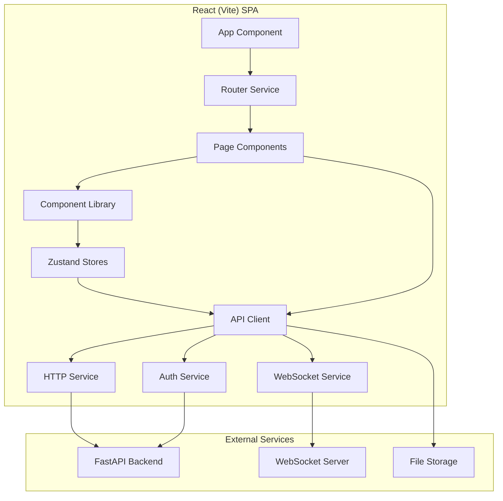

# Design Document: Next.js to React (Vite) Migration

## Overview

This document outlines the technical design for migrating an existing Next.js application with App Router to a clean React Single Page Application (SPA) using Vite as the build tool. The migration preserves all existing functionality while improving code organization, developer experience, and build performance.

### Current Architecture

The existing Next.js application features:
- **Multi-step wizard workflow**: Project setup → Research configuration → Survey generation → Survey builder
- **JWT-based authentication** with token management
- **WebSocket integration** for real-time progress streaming
- **Survey builder** with drag-and-drop functionality
- **File operations** for document upload/download
- **Zustand state management** for application state
- **Tailwind CSS** for styling
- **FastAPI backend integration** with REST and WebSocket APIs

### Target Architecture

The migrated React (Vite) SPA will maintain identical functionality with:
- **Vite build system** for fast development and optimized production builds
- **React Router** for client-side routing
- **Component-based architecture** with reusable component library
- **TypeScript** throughout for type safety
- **Modular service architecture** for API, WebSocket, and authentication
- **Performance optimizations** including code splitting and lazy loading

### Migration Benefits

- **Improved Developer Experience**: Faster build times, better HMR, simplified configuration
- **Better Performance**: Optimized bundle sizes, efficient code splitting
- **Cleaner Architecture**: Separation of concerns, reusable components
- **Enhanced Maintainability**: Better TypeScript integration, modular structure
- **Future-Proof**: Modern tooling and practices

## Architecture

### High-Level Architecture



### Directory Structure

```
src/
├── components/           # Reusable UI components
│   ├── ui/              # Basic UI components (Button, Input, etc.)
│   ├── forms/           # Form components
│   ├── layout/          # Layout components (Header, Sidebar, etc.)
│   └── survey/          # Survey-specific components
├── pages/               # Page components
│   ├── HomePage.tsx
│   ├── LoginPage.tsx
│   ├── ResearchPage.tsx
│   ├── GeneratePage.tsx
│   └── BuilderPage.tsx
├── services/            # External service integrations
│   ├── api/             # API client and endpoints
│   ├── websocket/       # WebSocket service
│   ├── auth/            # Authentication service
│   └── storage/         # Local storage utilities
├── stores/              # Zustand state stores
│   ├── authStore.ts
│   ├── surveyStore.ts
│   ├── uiStore.ts
│   └── index.ts
├── hooks/               # Custom React hooks
├── utils/               # Utility functions
├── types/               # TypeScript type definitions
├── constants/           # Application constants
└── assets/              # Static assets
```

### Technology Stack

- **Build Tool**: Vite 5.x
- **Framework**: React 18.x
- **Routing**: React Router 6.x
- **State Management**: Zustand 4.x
- **Styling**: Tailwind CSS 3.x
- **HTTP Client**: Axios
- **WebSocket**: Native WebSocket API with reconnection logic
- **TypeScript**: 5.x
- **Development**: ESLint, Prettier, Vitest

## Components and Interfaces

### Core Components Architecture

#### 1. Application Shell

```typescript
// App.tsx
interface AppProps {}

const App: React.FC<AppProps> = () => {
  return (
    <BrowserRouter>
      <AuthProvider>
        <ErrorBoundary>
          <Layout>
            <Routes>
              <Route path="/" element={<HomePage />} />
              <Route path="/login" element={<LoginPage />} />
              <Route path="/research" element={<ProtectedRoute><ResearchPage /></ProtectedRoute>} />
              <Route path="/generate" element={<ProtectedRoute><GeneratePage /></ProtectedRoute>} />
              <Route path="/builder" element={<ProtectedRoute><BuilderPage /></ProtectedRoute>} />
            </Routes>
          </Layout>
        </ErrorBoundary>
      </AuthProvider>
    </BrowserRouter>
  );
};
```

#### 2. Layout Components

```typescript
// components/layout/Layout.tsx
interface LayoutProps {
  children: React.ReactNode;
}

const Layout: React.FC<LayoutProps> = ({ children }) => {
  const { user, isAuthenticated } = useAuthStore();
  
  return (
    <div className="min-h-screen bg-gray-50">
      <Header />
      <main className="container mx-auto px-4 py-8">
        {children}
      </main>
      <Footer />
      <NotificationContainer />
      <LoadingOverlay />
    </div>
  );
};

// components/layout/Header.tsx
const Header: React.FC = () => {
  const { user, logout } = useAuthStore();
  const navigate = useNavigate();
  
  return (
    <header className="bg-white shadow-sm border-b">
      <nav className="container mx-auto px-4 py-4 flex justify-between items-center">
        <Logo />
        <NavigationMenu />
        {user && <UserMenu user={user} onLogout={logout} />}
      </nav>
    </header>
  );
};
```

#### 3. Protected Route Component

```typescript
// components/auth/ProtectedRoute.tsx
interface ProtectedRouteProps {
  children: React.ReactNode;
  requiredRole?: string;
}

const ProtectedRoute: React.FC<ProtectedRouteProps> = ({ 
  children, 
  requiredRole 
}) => {
  const { isAuthenticated, user, isLoading } = useAuthStore();
  const location = useLocation();
  
  if (isLoading) {
    return <LoadingSpinner />;
  }
  
  if (!isAuthenticated) {
    return <Navigate to="/login" state={{ from: location }} replace />;
  }
  
  if (requiredRole && user?.role !== requiredRole) {
    return <Navigate to="/" replace />;
  }
  
  return <>{children}</>;
};
```

#### 4. Form Components

```typescript
// components/forms/ProjectSetupForm.tsx
interface ProjectSetupFormProps {
  onSubmit: (data: ProjectSetupData) => void;
  initialData?: Partial<ProjectSetupData>;
  isLoading?: boolean;
}

const ProjectSetupForm: React.FC<ProjectSetupFormProps> = ({
  onSubmit,
  initialData,
  isLoading = false
}) => {
  const { register, handleSubmit, formState: { errors } } = useForm<ProjectSetupData>({
    defaultValues: initialData
  });
  
  return (
    <form onSubmit={handleSubmit(onSubmit)} className="space-y-6">
      <FormField
        label="Project Name"
        error={errors.projectName?.message}
        required
      >
        <Input
          {...register('projectName', { required: 'Project name is required' })}
          placeholder="Enter project name"
        />
      </FormField>
      
      <FormField
        label="Company Name"
        error={errors.companyName?.message}
        required
      >
        <Input
          {...register('companyName', { required: 'Company name is required' })}
          placeholder="Enter company name"
        />
      </FormField>
      
      <Button type="submit" loading={isLoading} className="w-full">
        Continue to Research
      </Button>
    </form>
  );
};
```

#### 5. Survey Builder Components

```typescript
// components/survey/SurveyBuilder.tsx
interface SurveyBuilderProps {
  survey: Survey;
  onSurveyChange: (survey: Survey) => void;
  onSave: () => void;
}

const SurveyBuilder: React.FC<SurveyBuilderProps> = ({
  survey,
  onSurveyChange,
  onSave
}) => {
  const [draggedItem, setDraggedItem] = useState<QuestionType | null>(null);
  
  return (
    <div className="flex h-full">
      <QuestionPalette
        onDragStart={setDraggedItem}
        onDragEnd={() => setDraggedItem(null)}
      />
      
      <SurveyCanvas
        survey={survey}
        draggedItem={draggedItem}
        onSurveyChange={onSurveyChange}
        onDropQuestion={handleDropQuestion}
      />
      
      <PropertiesPanel
        selectedQuestion={selectedQuestion}
        onQuestionUpdate={handleQuestionUpdate}
      />
    </div>
  );
};

// components/survey/QuestionPalette.tsx
const QuestionPalette: React.FC<QuestionPaletteProps> = ({
  onDragStart,
  onDragEnd
}) => {
  const questionTypes = [
    { type: 'multiple-choice', label: 'Multiple Choice', icon: CheckCircleIcon },
    { type: 'text', label: 'Text Input', icon: DocumentTextIcon },
    { type: 'matrix', label: 'Matrix', icon: TableCellsIcon },
    { type: 'video', label: 'Video Question', icon: VideoCameraIcon }
  ];
  
  return (
    <div className="w-64 bg-white border-r p-4">
      <h3 className="font-semibold mb-4">Question Types</h3>
      <div className="space-y-2">
        {questionTypes.map((questionType) => (
          <DraggableQuestionType
            key={questionType.type}
            questionType={questionType}
            onDragStart={onDragStart}
            onDragEnd={onDragEnd}
          />
        ))}
      </div>
    </div>
  );
};
```

### UI Component Library

#### Base Components

```typescript
// components/ui/Button.tsx
interface ButtonProps extends React.ButtonHTMLAttributes<HTMLButtonElement> {
  variant?: 'primary' | 'secondary' | 'outline' | 'ghost';
  size?: 'sm' | 'md' | 'lg';
  loading?: boolean;
  icon?: React.ReactNode;
}

const Button: React.FC<ButtonProps> = ({
  variant = 'primary',
  size = 'md',
  loading = false,
  icon,
  children,
  className,
  disabled,
  ...props
}) => {
  const baseClasses = 'inline-flex items-center justify-center font-medium rounded-md transition-colors focus:outline-none focus:ring-2 focus:ring-offset-2';
  
  const variantClasses = {
    primary: 'bg-blue-600 text-white hover:bg-blue-700 focus:ring-blue-500',
    secondary: 'bg-gray-600 text-white hover:bg-gray-700 focus:ring-gray-500',
    outline: 'border border-gray-300 bg-white text-gray-700 hover:bg-gray-50 focus:ring-blue-500',
    ghost: 'text-gray-700 hover:bg-gray-100 focus:ring-gray-500'
  };
  
  const sizeClasses = {
    sm: 'px-3 py-2 text-sm',
    md: 'px-4 py-2 text-sm',
    lg: 'px-6 py-3 text-base'
  };
  
  return (
    <button
      className={cn(
        baseClasses,
        variantClasses[variant],
        sizeClasses[size],
        (disabled || loading) && 'opacity-50 cursor-not-allowed',
        className
      )}
      disabled={disabled || loading}
      {...props}
    >
      {loading && <Spinner className="mr-2 h-4 w-4" />}
      {icon && !loading && <span className="mr-2">{icon}</span>}
      {children}
    </button>
  );
};

// components/ui/Input.tsx
interface InputProps extends React.InputHTMLAttributes<HTMLInputElement> {
  error?: string;
  label?: string;
  helperText?: string;
}

const Input = React.forwardRef<HTMLInputElement, InputProps>(({
  error,
  label,
  helperText,
  className,
  ...props
}, ref) => {
  return (
    <div className="space-y-1">
      {label && (
        <label className="block text-sm font-medium text-gray-700">
          {label}
        </label>
      )}
      <input
        ref={ref}
        className={cn(
          'block w-full px-3 py-2 border border-gray-300 rounded-md shadow-sm',
          'focus:outline-none focus:ring-blue-500 focus:border-blue-500',
          error && 'border-red-300 focus:ring-red-500 focus:border-red-500',
          className
        )}
        {...props}
      />
      {error && (
        <p className="text-sm text-red-600">{error}</p>
      )}
      {helperText && !error && (
        <p className="text-sm text-gray-500">{helperText}</p>
      )}
    </div>
  );
});
```

## Data Models

### TypeScript Interfaces

#### Authentication Models

```typescript
// types/auth.ts
export interface User {
  username: string;
  isActive: boolean;
  createdAt: string;
  updatedAt: string;
}

export interface LoginCredentials {
  username: string;
  password: string;
}

export interface RegisterData {
  username: string;
  password: string;
}

export interface AuthTokens {
  accessToken: string;
  tokenType: string;
}

export interface AuthState {
  user: User | null;
  tokens: AuthTokens | null;
  isAuthenticated: boolean;
  isLoading: boolean;
  error: string | null;
}
```

#### Survey Models

```typescript
// types/survey.ts
export interface ProjectSetupData {
  projectName: string;
  companyName: string;
  industry: string;
  useCase: string;
}

export interface BusinessOverviewRequest {
  requestId: string;
  projectName: string;
  companyName: string;
  industry: string;
  useCase: string;
  llmModel: string;
}

export interface BusinessOverviewResponse {
  success: number;
  requestId: string;
  projectName: string;
  companyName: string;
  businessOverview: string;
  industry: string;
  useCase: string;
}

export interface ResearchObjectiveRequest {
  requestId: string;
  projectName: string;
  companyName: string;
  businessOverview: string;
  industry: string;
  useCase: string;
  llmModel: string;
}

export interface SurveyGenerationRequest {
  requestId: string;
  projectName: string;
  companyName: string;
  businessOverview: string;
  researchObjectives: string;
  industry: string;
  useCase: string;
  llmModel: string;
}

export interface SurveyStatusResponse {
  success: number;
  status: 'PENDING' | 'STARTING' | 'RUNNING' | 'COMPLETED' | 'FAILED';
  requestId: string;
  projectName: string;
  companyName: string;
  researchObjectives: string;
  businessOverview: string;
  industry: string;
  useCase: string;
  pages: any;
  docLink: string;
}

export interface Question {
  id: string;
  type: 'multiple-choice' | 'text' | 'matrix' | 'video';
  title: string;
  description?: string;
  required: boolean;
  choices?: Choice[];
  validation?: ValidationRule[];
}

export interface Choice {
  id: string;
  text: string;
  value: string;
}

export interface Survey {
  id: string;
  title: string;
  description: string;
  pages: SurveyPage[];
  settings: SurveySettings;
}

export interface SurveyPage {
  id: string;
  name: string;
  title: string;
  questions: Question[];
}

export interface SurveySettings {
  showProgressBar: boolean;
  showQuestionNumbers: boolean;
  allowBack: boolean;
  completeText: string;
}
```

#### WebSocket Models

```typescript
// types/websocket.ts
export interface WebSocketMessage {
  requestId: string;
  update: string;
  completed?: boolean;
}

export interface WebSocketState {
  isConnected: boolean;
  isConnecting: boolean;
  error: string | null;
  lastMessage: WebSocketMessage | null;
  connectionAttempts: number;
}

export type WebSocketStatus = 'disconnected' | 'connecting' | 'connected' | 'error';
```

#### API Models

```typescript
// types/api.ts
export interface ApiResponse<T = any> {
  data: T;
  success: boolean;
  message?: string;
}

export interface ApiError {
  detail: string;
  errorCode?: string;
  timestamp?: string;
}

export interface PaginatedResponse<T> {
  items: T[];
  total: number;
  page: number;
  pageSize: number;
  totalPages: number;
}

export interface FileUploadResponse {
  filename: string;
  url: string;
  size: number;
}
```

### State Management Models

```typescript
// types/store.ts
export interface RootState {
  auth: AuthState;
  survey: SurveyState;
  ui: UIState;
  websocket: WebSocketState;
}

export interface SurveyState {
  currentProject: ProjectSetupData | null;
  businessOverview: string | null;
  researchObjectives: string | null;
  currentSurvey: Survey | null;
  generationStatus: SurveyStatusResponse | null;
  isGenerating: boolean;
  error: string | null;
}

export interface UIState {
  isLoading: boolean;
  notifications: Notification[];
  modals: ModalState[];
  sidebarOpen: boolean;
  theme: 'light' | 'dark';
}

export interface Notification {
  id: string;
  type: 'success' | 'error' | 'warning' | 'info';
  title: string;
  message: string;
  duration?: number;
  actions?: NotificationAction[];
}

export interface ModalState {
  id: string;
  component: string;
  props: Record<string, any>;
  isOpen: boolean;
}
```

## Service Architecture

### API Client Service

#### HTTP Service Implementation

```typescript
// services/api/httpService.ts
import axios, { AxiosInstance, AxiosRequestConfig, AxiosResponse } from 'axios';
import { useAuthStore } from '@/stores/authStore';
import { ApiResponse, ApiError } from '@/types/api';

class HttpService {
  private client: AxiosInstance;
  private baseURL: string;

  constructor(baseURL: string = import.meta.env.VITE_API_BASE_URL) {
    this.baseURL = baseURL;
    this.client = axios.create({
      baseURL,
      timeout: 30000,
      headers: {
        'Content-Type': 'application/json',
      },
    });

    this.setupInterceptors();
  }

  private setupInterceptors(): void {
    // Request interceptor for auth token
    this.client.interceptors.request.use(
      (config) => {
        const { tokens } = useAuthStore.getState();
        if (tokens?.accessToken) {
          config.headers.Authorization = `Bearer ${tokens.accessToken}`;
        }
        return config;
      },
      (error) => Promise.reject(error)
    );

    // Response interceptor for error handling
    this.client.interceptors.response.use(
      (response) => response,
      async (error) => {
        const originalRequest = error.config;

        // Handle 401 errors (token expired)
        if (error.response?.status === 401 && !originalRequest._retry) {
          originalRequest._retry = true;
          
          const { logout } = useAuthStore.getState();
          logout();
          
          // Redirect to login
          window.location.href = '/login';
          return Promise.reject(error);
        }

        // Handle network errors
        if (!error.response) {
          throw new Error('Network error - please check your connection');
        }

        // Transform API errors
        const apiError: ApiError = {
          detail: error.response.data?.detail || 'An unexpected error occurred',
          errorCode: error.response.data?.errorCode,
          timestamp: error.response.data?.timestamp,
        };

        throw apiError;
      }
    );
  }

  async get<T>(url: string, config?: AxiosRequestConfig): Promise<T> {
    const response = await this.client.get<T>(url, config);
    return response.data;
  }

  async post<T>(url: string, data?: any, config?: AxiosRequestConfig): Promise<T> {
    const response = await this.client.post<T>(url, data, config);
    return response.data;
  }

  async put<T>(url: string, data?: any, config?: AxiosRequestConfig): Promise<T> {
    const response = await this.client.put<T>(url, data, config);
    return response.data;
  }

  async delete<T>(url: string, config?: AxiosRequestConfig): Promise<T> {
    const response = await this.client.delete<T>(url, config);
    return response.data;
  }

  async uploadFile(url: string, file: File, onProgress?: (progress: number) => void): Promise<any> {
    const formData = new FormData();
    formData.append('file', file);

    return this.client.post(url, formData, {
      headers: {
        'Content-Type': 'multipart/form-data',
      },
      onUploadProgress: (progressEvent) => {
        if (onProgress && progressEvent.total) {
          const progress = Math.round((progressEvent.loaded * 100) / progressEvent.total);
          onProgress(progress);
        }
      },
    });
  }

  async downloadFile(url: string, filename?: string): Promise<void> {
    const response = await this.client.get(url, {
      responseType: 'blob',
    });

    const blob = new Blob([response.data]);
    const downloadUrl = window.URL.createObjectURL(blob);
    const link = document.createElement('a');
    link.href = downloadUrl;
    link.download = filename || 'download';
    document.body.appendChild(link);
    link.click();
    document.body.removeChild(link);
    window.URL.revokeObjectURL(downloadUrl);
  }
}

export const httpService = new HttpService();
```

#### API Endpoints Service

```typescript
// services/api/endpoints.ts
import { httpService } from './httpService';
import {
  LoginCredentials,
  RegisterData,
  AuthTokens,
  BusinessOverviewRequest,
  BusinessOverviewResponse,
  ResearchObjectiveRequest,
  SurveyGenerationRequest,
  SurveyStatusResponse,
} from '@/types';

export class ApiEndpoints {
  // Authentication endpoints
  static async login(credentials: LoginCredentials): Promise<AuthTokens> {
    return httpService.post<AuthTokens>('/api/v1/auth/login', credentials);
  }

  static async register(data: RegisterData): Promise<AuthTokens> {
    return httpService.post<AuthTokens>('/api/v1/auth/register', data);
  }

  // Survey endpoints
  static async generateBusinessOverview(request: BusinessOverviewRequest): Promise<BusinessOverviewResponse> {
    return httpService.post<BusinessOverviewResponse>('/api/v1/surveys/business-overview', request);
  }

  static async generateResearchObjectives(request: ResearchObjectiveRequest): Promise<any> {
    return httpService.post('/api/v1/surveys/research-objectives', request);
  }

  static async generateBusinessResearch(request: BusinessOverviewRequest): Promise<any> {
    return httpService.post('/api/v1/surveys/business-research', request);
  }

  static async generateSurvey(request: SurveyGenerationRequest): Promise<SurveyStatusResponse> {
    return httpService.post<SurveyStatusResponse>('/api/v1/surveys/generate', request);
  }

  static async getSurveyStatus(requestId: string): Promise<SurveyStatusResponse> {
    return httpService.get<SurveyStatusResponse>(`/api/v1/surveys/status/${requestId}`);
  }

  // File endpoints
  static async downloadSurveyDocument(filename: string): Promise<void> {
    return httpService.downloadFile(`/api/v1/files/download/${filename}`, filename);
  }
}
```

### WebSocket Service

```typescript
// services/websocket/websocketService.ts
import { WebSocketMessage, WebSocketState, WebSocketStatus } from '@/types/websocket';

export class WebSocketService {
  private ws: WebSocket | null = null;
  private url: string;
  private reconnectAttempts = 0;
  private maxReconnectAttempts = 5;
  private reconnectInterval = 1000;
  private listeners: Map<string, (message: WebSocketMessage) => void> = new Map();
  private statusListeners: Set<(status: WebSocketStatus) => void> = new Set();
  private isManualClose = false;

  constructor(baseUrl: string = import.meta.env.VITE_WS_BASE_URL) {
    this.url = baseUrl;
  }

  connect(requestId: string): Promise<void> {
    return new Promise((resolve, reject) => {
      try {
        this.isManualClose = false;
        const wsUrl = `${this.url}/ws/survey/${requestId}`;
        this.ws = new WebSocket(wsUrl);

        this.ws.onopen = () => {
          console.log('WebSocket connected');
          this.reconnectAttempts = 0;
          this.notifyStatusListeners('connected');
          resolve();
        };

        this.ws.onmessage = (event) => {
          try {
            const message: WebSocketMessage = JSON.parse(event.data);
            this.notifyListeners(requestId, message);
          } catch (error) {
            console.error('Failed to parse WebSocket message:', error);
          }
        };

        this.ws.onclose = (event) => {
          console.log('WebSocket closed:', event.code, event.reason);
          this.notifyStatusListeners('disconnected');
          
          if (!this.isManualClose && this.reconnectAttempts < this.maxReconnectAttempts) {
            this.scheduleReconnect(requestId);
          }
        };

        this.ws.onerror = (error) => {
          console.error('WebSocket error:', error);
          this.notifyStatusListeners('error');
          reject(error);
        };

        // Connection timeout
        setTimeout(() => {
          if (this.ws?.readyState === WebSocket.CONNECTING) {
            this.ws.close();
            reject(new Error('WebSocket connection timeout'));
          }
        }, 5000);

      } catch (error) {
        reject(error);
      }
    });
  }

  private scheduleReconnect(requestId: string): void {
    this.reconnectAttempts++;
    const delay = this.reconnectInterval * Math.pow(2, this.reconnectAttempts - 1);
    
    console.log(`Attempting to reconnect in ${delay}ms (attempt ${this.reconnectAttempts})`);
    this.notifyStatusListeners('connecting');
    
    setTimeout(() => {
      this.connect(requestId).catch((error) => {
        console.error('Reconnection failed:', error);
      });
    }, delay);
  }

  disconnect(): void {
    this.isManualClose = true;
    if (this.ws) {
      this.ws.close();
      this.ws = null;
    }
    this.listeners.clear();
    this.notifyStatusListeners('disconnected');
  }

  subscribe(requestId: string, callback: (message: WebSocketMessage) => void): () => void {
    this.listeners.set(requestId, callback);
    
    // Return unsubscribe function
    return () => {
      this.listeners.delete(requestId);
    };
  }

  onStatusChange(callback: (status: WebSocketStatus) => void): () => void {
    this.statusListeners.add(callback);
    
    // Return unsubscribe function
    return () => {
      this.statusListeners.delete(callback);
    };
  }

  private notifyListeners(requestId: string, message: WebSocketMessage): void {
    const callback = this.listeners.get(requestId);
    if (callback) {
      callback(message);
    }
  }

  private notifyStatusListeners(status: WebSocketStatus): void {
    this.statusListeners.forEach(callback => callback(status));
  }

  getConnectionState(): WebSocketStatus {
    if (!this.ws) return 'disconnected';
    
    switch (this.ws.readyState) {
      case WebSocket.CONNECTING:
        return 'connecting';
      case WebSocket.OPEN:
        return 'connected';
      case WebSocket.CLOSING:
      case WebSocket.CLOSED:
        return 'disconnected';
      default:
        return 'error';
    }
  }
}

export const websocketService = new WebSocketService();
```

### Authentication Service

```typescript
// services/auth/authService.ts
import { ApiEndpoints } from '@/services/api/endpoints';
import { LoginCredentials, RegisterData, AuthTokens, User } from '@/types/auth';
import { StorageService } from '@/services/storage/storageService';

export class AuthService {
  private static readonly TOKEN_KEY = 'auth_tokens';
  private static readonly USER_KEY = 'auth_user';

  static async login(credentials: LoginCredentials): Promise<{ tokens: AuthTokens; user: User }> {
    try {
      const tokens = await ApiEndpoints.login(credentials);
      
      // Store tokens
      StorageService.setItem(this.TOKEN_KEY, tokens);
      
      // Create user object (since backend doesn't return user info in login)
      const user: User = {
        username: credentials.username,
        isActive: true,
        createdAt: new Date().toISOString(),
        updatedAt: new Date().toISOString(),
      };
      
      StorageService.setItem(this.USER_KEY, user);
      
      return { tokens, user };
    } catch (error) {
      throw error;
    }
  }

  static async register(data: RegisterData): Promise<{ tokens: AuthTokens; user: User }> {
    try {
      const tokens = await ApiEndpoints.register(data);
      
      // Store tokens
      StorageService.setItem(this.TOKEN_KEY, tokens);
      
      // Create user object
      const user: User = {
        username: data.username,
        isActive: true,
        createdAt: new Date().toISOString(),
        updatedAt: new Date().toISOString(),
      };
      
      StorageService.setItem(this.USER_KEY, user);
      
      return { tokens, user };
    } catch (error) {
      throw error;
    }
  }

  static logout(): void {
    StorageService.removeItem(this.TOKEN_KEY);
    StorageService.removeItem(this.USER_KEY);
  }

  static getStoredTokens(): AuthTokens | null {
    return StorageService.getItem<AuthTokens>(this.TOKEN_KEY);
  }

  static getStoredUser(): User | null {
    return StorageService.getItem<User>(this.USER_KEY);
  }

  static isTokenValid(tokens: AuthTokens): boolean {
    if (!tokens?.accessToken) return false;
    
    try {
      // Decode JWT token to check expiration
      const payload = JSON.parse(atob(tokens.accessToken.split('.')[1]));
      const currentTime = Date.now() / 1000;
      
      return payload.exp > currentTime;
    } catch (error) {
      return false;
    }
  }

  static async validateSession(): Promise<{ tokens: AuthTokens; user: User } | null> {
    const tokens = this.getStoredTokens();
    const user = this.getStoredUser();
    
    if (!tokens || !user) {
      return null;
    }
    
    if (!this.isTokenValid(tokens)) {
      this.logout();
      return null;
    }
    
    return { tokens, user };
  }
}
```

### Storage Service

```typescript
// services/storage/storageService.ts
export class StorageService {
  private static isLocalStorageAvailable(): boolean {
    try {
      const test = '__localStorage_test__';
      localStorage.setItem(test, test);
      localStorage.removeItem(test);
      return true;
    } catch {
      return false;
    }
  }

  static setItem<T>(key: string, value: T): void {
    if (!this.isLocalStorageAvailable()) {
      console.warn('localStorage is not available');
      return;
    }

    try {
      const serializedValue = JSON.stringify(value);
      localStorage.setItem(key, serializedValue);
    } catch (error) {
      console.error('Failed to store item in localStorage:', error);
    }
  }

  static getItem<T>(key: string): T | null {
    if (!this.isLocalStorageAvailable()) {
      return null;
    }

    try {
      const item = localStorage.getItem(key);
      return item ? JSON.parse(item) : null;
    } catch (error) {
      console.error('Failed to retrieve item from localStorage:', error);
      return null;
    }
  }

  static removeItem(key: string): void {
    if (!this.isLocalStorageAvailable()) {
      return;
    }

    try {
      localStorage.removeItem(key);
    } catch (error) {
      console.error('Failed to remove item from localStorage:', error);
    }
  }

  static clear(): void {
    if (!this.isLocalStorageAvailable()) {
      return;
    }

    try {
      localStorage.clear();
    } catch (error) {
      console.error('Failed to clear localStorage:', error);
    }
  }
}
```

## State Management with Zustand

### Authentication Store

```typescript
// stores/authStore.ts
import { create } from 'zustand';
import { devtools, persist } from 'zustand/middleware';
import { AuthState, LoginCredentials, RegisterData } from '@/types/auth';
import { AuthService } from '@/services/auth/authService';

interface AuthStore extends AuthState {
  // Actions
  login: (credentials: LoginCredentials) => Promise<void>;
  register: (data: RegisterData) => Promise<void>;
  logout: () => void;
  validateSession: () => Promise<void>;
  clearError: () => void;
}

export const useAuthStore = create<AuthStore>()(
  devtools(
    persist(
      (set, get) => ({
        // Initial state
        user: null,
        tokens: null,
        isAuthenticated: false,
        isLoading: false,
        error: null,

        // Actions
        login: async (credentials) => {
          set({ isLoading: true, error: null });
          
          try {
            const { tokens, user } = await AuthService.login(credentials);
            set({
              user,
              tokens,
              isAuthenticated: true,
              isLoading: false,
              error: null,
            });
          } catch (error: any) {
            set({
              isLoading: false,
              error: error.detail || 'Login failed',
            });
            throw error;
          }
        },

        register: async (data) => {
          set({ isLoading: true, error: null });
          
          try {
            const { tokens, user } = await AuthService.register(data);
            set({
              user,
              tokens,
              isAuthenticated: true,
              isLoading: false,
              error: null,
            });
          } catch (error: any) {
            set({
              isLoading: false,
              error: error.detail || 'Registration failed',
            });
            throw error;
          }
        },

        logout: () => {
          AuthService.logout();
          set({
            user: null,
            tokens: null,
            isAuthenticated: false,
            error: null,
          });
        },

        validateSession: async () => {
          set({ isLoading: true });
          
          try {
            const session = await AuthService.validateSession();
            
            if (session) {
              set({
                user: session.user,
                tokens: session.tokens,
                isAuthenticated: true,
                isLoading: false,
              });
            } else {
              set({
                user: null,
                tokens: null,
                isAuthenticated: false,
                isLoading: false,
              });
            }
          } catch (error) {
            set({
              user: null,
              tokens: null,
              isAuthenticated: false,
              isLoading: false,
            });
          }
        },

        clearError: () => {
          set({ error: null });
        },
      }),
      {
        name: 'auth-store',
        partialize: (state) => ({
          user: state.user,
          tokens: state.tokens,
          isAuthenticated: state.isAuthenticated,
        }),
      }
    ),
    { name: 'AuthStore' }
  )
);
```

### Survey Store

```typescript
// stores/surveyStore.ts
import { create } from 'zustand';
import { devtools } from 'zustand/middleware';
import { SurveyState, ProjectSetupData, Survey } from '@/types';
import { ApiEndpoints } from '@/services/api/endpoints';
import { websocketService } from '@/services/websocket/websocketService';
import { generateRequestId } from '@/utils/helpers';

interface SurveyStore extends SurveyState {
  // Actions
  setCurrentProject: (project: ProjectSetupData) => void;
  generateBusinessOverview: (llmModel?: string) => Promise<void>;
  generateResearchObjectives: (llmModel?: string) => Promise<void>;
  generateSurvey: (llmModel?: string) => Promise<void>;
  pollSurveyStatus: (requestId: string) => Promise<void>;
  subscribeToProgress: (requestId: string) => () => void;
  updateSurvey: (survey: Survey) => void;
  clearError: () => void;
  reset: () => void;
}

export const useSurveyStore = create<SurveyStore>()(
  devtools(
    (set, get) => ({
      // Initial state
      currentProject: null,
      businessOverview: null,
      researchObjectives: null,
      currentSurvey: null,
      generationStatus: null,
      isGenerating: false,
      error: null,

      // Actions
      setCurrentProject: (project) => {
        set({ currentProject: project });
      },

      generateBusinessOverview: async (llmModel = 'gpt') => {
        const { currentProject } = get();
        if (!currentProject) {
          throw new Error('No project data available');
        }

        set({ isGenerating: true, error: null });

        try {
          const requestId = generateRequestId();
          const response = await ApiEndpoints.generateBusinessOverview({
            requestId,
            projectName: currentProject.projectName,
            companyName: currentProject.companyName,
            industry: currentProject.industry,
            useCase: currentProject.useCase,
            llmModel,
          });

          set({
            businessOverview: response.businessOverview,
            isGenerating: false,
          });
        } catch (error: any) {
          set({
            isGenerating: false,
            error: error.detail || 'Failed to generate business overview',
          });
          throw error;
        }
      },

      generateResearchObjectives: async (llmModel = 'gpt') => {
        const { currentProject, businessOverview } = get();
        if (!currentProject || !businessOverview) {
          throw new Error('Missing project data or business overview');
        }

        set({ isGenerating: true, error: null });

        try {
          const requestId = generateRequestId();
          const response = await ApiEndpoints.generateResearchObjectives({
            requestId,
            projectName: currentProject.projectName,
            companyName: currentProject.companyName,
            businessOverview,
            industry: currentProject.industry,
            useCase: currentProject.useCase,
            llmModel,
          });

          set({
            researchObjectives: response.research_objectives,
            isGenerating: false,
          });
        } catch (error: any) {
          set({
            isGenerating: false,
            error: error.detail || 'Failed to generate research objectives',
          });
          throw error;
        }
      },

      generateSurvey: async (llmModel = 'gpt') => {
        const { currentProject, businessOverview, researchObjectives } = get();
        if (!currentProject || !businessOverview || !researchObjectives) {
          throw new Error('Missing required data for survey generation');
        }

        set({ isGenerating: true, error: null });

        try {
          const requestId = generateRequestId();
          const response = await ApiEndpoints.generateSurvey({
            requestId,
            projectName: currentProject.projectName,
            companyName: currentProject.companyName,
            businessOverview,
            researchObjectives,
            industry: currentProject.industry,
            useCase: currentProject.useCase,
            llmModel,
          });

          set({
            generationStatus: response,
          });

          // If generation is running, subscribe to WebSocket updates
          if (response.status === 'RUNNING') {
            get().subscribeToProgress(requestId);
          } else if (response.status === 'COMPLETED') {
            set({ isGenerating: false });
          }
        } catch (error: any) {
          set({
            isGenerating: false,
            error: error.detail || 'Failed to start survey generation',
          });
          throw error;
        }
      },

      pollSurveyStatus: async (requestId) => {
        try {
          const response = await ApiEndpoints.getSurveyStatus(requestId);
          set({ generationStatus: response });

          if (response.status === 'COMPLETED' || response.status === 'FAILED') {
            set({ isGenerating: false });
          }
        } catch (error: any) {
          set({
            error: error.detail || 'Failed to get survey status',
          });
        }
      },

      subscribeToProgress: (requestId) => {
        const unsubscribe = websocketService.subscribe(requestId, (message) => {
          const { generationStatus } = get();
          
          if (generationStatus) {
            const updatedStatus = {
              ...generationStatus,
              status: message.update as any,
            };
            
            set({ generationStatus: updatedStatus });

            if (message.completed) {
              set({ isGenerating: false });
              websocketService.disconnect();
            }
          }
        });

        // Connect to WebSocket
        websocketService.connect(requestId).catch((error) => {
          console.error('Failed to connect to WebSocket:', error);
          // Fall back to polling
          const pollInterval = setInterval(() => {
            get().pollSurveyStatus(requestId);
          }, 2000);

          // Clean up polling when generation completes
          const checkCompletion = () => {
            const { generationStatus, isGenerating } = get();
            if (!isGenerating || generationStatus?.status === 'COMPLETED' || generationStatus?.status === 'FAILED') {
              clearInterval(pollInterval);
            } else {
              setTimeout(checkCompletion, 1000);
            }
          };
          checkCompletion();
        });

        return unsubscribe;
      },

      updateSurvey: (survey) => {
        set({ currentSurvey: survey });
      },

      clearError: () => {
        set({ error: null });
      },

      reset: () => {
        set({
          currentProject: null,
          businessOverview: null,
          researchObjectives: null,
          currentSurvey: null,
          generationStatus: null,
          isGenerating: false,
          error: null,
        });
      },
    }),
    { name: 'SurveyStore' }
  )
);
```

### UI Store

```typescript
// stores/uiStore.ts
import { create } from 'zustand';
import { devtools } from 'zustand/middleware';
import { UIState, Notification, ModalState } from '@/types';

interface UIStore extends UIState {
  // Actions
  setLoading: (loading: boolean) => void;
  addNotification: (notification: Omit<Notification, 'id'>) => void;
  removeNotification: (id: string) => void;
  clearNotifications: () => void;
  openModal: (modal: Omit<ModalState, 'id' | 'isOpen'>) => string;
  closeModal: (id: string) => void;
  closeAllModals: () => void;
  toggleSidebar: () => void;
  setSidebarOpen: (open: boolean) => void;
  setTheme: (theme: 'light' | 'dark') => void;
}

export const useUIStore = create<UIStore>()(
  devtools(
    (set, get) => ({
      // Initial state
      isLoading: false,
      notifications: [],
      modals: [],
      sidebarOpen: false,
      theme: 'light',

      // Actions
      setLoading: (loading) => {
        set({ isLoading: loading });
      },

      addNotification: (notification) => {
        const id = Math.random().toString(36).substr(2, 9);
        const newNotification: Notification = {
          ...notification,
          id,
        };

        set((state) => ({
          notifications: [...state.notifications, newNotification],
        }));

        // Auto-remove notification after duration
        if (notification.duration !== 0) {
          const duration = notification.duration || 5000;
          setTimeout(() => {
            get().removeNotification(id);
          }, duration);
        }
      },

      removeNotification: (id) => {
        set((state) => ({
          notifications: state.notifications.filter((n) => n.id !== id),
        }));
      },

      clearNotifications: () => {
        set({ notifications: [] });
      },

      openModal: (modal) => {
        const id = Math.random().toString(36).substr(2, 9);
        const newModal: ModalState = {
          ...modal,
          id,
          isOpen: true,
        };

        set((state) => ({
          modals: [...state.modals, newModal],
        }));

        return id;
      },

      closeModal: (id) => {
        set((state) => ({
          modals: state.modals.filter((m) => m.id !== id),
        }));
      },

      closeAllModals: () => {
        set({ modals: [] });
      },

      toggleSidebar: () => {
        set((state) => ({ sidebarOpen: !state.sidebarOpen }));
      },

      setSidebarOpen: (open) => {
        set({ sidebarOpen: open });
      },

      setTheme: (theme) => {
        set({ theme });
        document.documentElement.classList.toggle('dark', theme === 'dark');
      },
    }),
    { name: 'UIStore' }
  )
);
```
## Correctness Properties

*A property is a characteristic or behavior that should hold true across all valid executions of a system-essentially, a formal statement about what the system should do. Properties serve as the bridge between human-readable specifications and machine-verifiable correctness guarantees.*

### Property 1: Router Navigation Consistency

*For any* valid route path in the application, navigating to that route should render the correct page component and update the browser URL accordingly.

**Validates: Requirements 1.2, 4.6**

### Property 2: State Management Persistence

*For any* application state that should persist across page refreshes, reloading the browser should preserve that state data.

**Validates: Requirements 1.3, 12.2**

### Property 3: Component Reusability

*For any* component in the component library, it should be usable in multiple contexts without modification and maintain consistent behavior across different usage scenarios.

**Validates: Requirements 1.5, 10.4**

### Property 4: TypeScript Type Safety

*For any* component, service, or store in the application, TypeScript compilation should succeed without type errors and provide comprehensive type coverage.

**Validates: Requirements 1.6, 10.5**

### Property 5: Wizard Workflow Continuity

*For any* step in the multi-step wizard workflow, completing that step should enable navigation to the next step and preserve all previously entered data.

**Validates: Requirements 2.2**

### Property 6: WebSocket Real-time Updates

*For any* WebSocket message received from the server, the user interface should update in real-time to reflect the new information.

**Validates: Requirements 2.3, 6.2**

### Property 7: Drag-and-Drop Functionality

*For any* draggable element in the survey builder, dropping it in a valid drop zone should successfully add or move the element and update the survey structure.

**Validates: Requirements 2.4, 11.1**

### Property 8: File Operation Success

*For any* valid file upload or download operation, the operation should complete successfully and provide appropriate feedback to the user.

**Validates: Requirements 2.5, 7.1, 7.2**

### Property 9: Authentication State Management

*For any* authentication operation (login, logout, session validation), the authentication state should be correctly updated and persisted across the application.

**Validates: Requirements 2.6, 5.2, 12.3**

### Property 10: API Compatibility

*For any* API endpoint call made by the application, it should use the same request format and handle responses identically to the original Next.js application.

**Validates: Requirements 3.1, 3.2**

### Property 11: WebSocket Protocol Consistency

*For any* WebSocket connection established by the application, it should follow the same connection protocol and message format as the original application.

**Validates: Requirements 3.3, 6.1**

### Property 12: JWT Token Management

*For any* JWT token operation (storage, retrieval, validation, refresh), the token should be handled identically to the original application's token management.

**Validates: Requirements 3.4, 5.1**

### Property 13: API Error Handling

*For any* API request that fails, the application should handle the error using the same retry logic and error messaging as the original application.

**Validates: Requirements 3.5, 9.2**

### Property 14: Authentication Flow Consistency

*For any* authentication failure or token expiration, the application should redirect to the login page and clear the authentication state.

**Validates: Requirements 5.3, 5.4**

### Property 15: Session Persistence

*For any* authenticated user session, refreshing the browser should maintain the authentication state if the token is still valid.

**Validates: Requirements 5.5**

### Property 16: WebSocket Reconnection

*For any* WebSocket connection that fails or is interrupted, the service should attempt to reconnect automatically with appropriate backoff logic.

**Validates: Requirements 6.3**

### Property 17: WebSocket State Management

*For any* WebSocket connection state change (connecting, connected, disconnected, error), the connection state should be properly tracked and reflected in the application.

**Validates: Requirements 6.4, 6.5**

### Property 18: File Validation

*For any* file selected for upload, the application should validate the file type and size before attempting to upload, rejecting invalid files with appropriate error messages.

**Validates: Requirements 7.3, 7.5**

### Property 19: Loading State Display

*For any* asynchronous operation (API calls, file operations), the application should display appropriate loading indicators during the operation.

**Validates: Requirements 7.4, 9.1**

### Property 20: Network Error Notification

*For any* network connectivity issue or API failure, the application should notify the user with clear, user-friendly error messages.

**Validates: Requirements 9.3**

### Property 21: Request Retry Logic

*For any* failed API request that is retryable, the application should implement appropriate retry mechanisms with exponential backoff.

**Validates: Requirements 9.4**

### Property 22: Error Logging

*For any* error that occurs in the application, it should be properly logged with sufficient context for debugging purposes.

**Validates: Requirements 9.5**

### Property 23: Question Type Support

*For any* question type supported in the original application (multiple choice, matrix, open-ended, video), the survey builder should support creating and editing that question type.

**Validates: Requirements 11.2**

### Property 24: Question Organization

*For any* survey structure with questions, the survey builder should maintain proper question ordering and support nesting capabilities.

**Validates: Requirements 11.3**

### Property 25: Survey State Integration

*For any* change made in the survey builder, the change should be properly reflected in the application state and persisted appropriately.

**Validates: Requirements 11.4, 12.4**

### Property 26: Survey Validation

*For any* survey structure being saved, the application should validate the survey structure and reject invalid surveys with appropriate error messages.

**Validates: Requirements 11.5**

### Property 27: Zustand State Management

*For any* state operation in the application, it should use Zustand for state management and maintain consistency across all components.

**Validates: Requirements 12.1**

### Property 28: Type-Safe State Access

*For any* state access operation in the application, it should be type-safe and provide proper TypeScript type checking.

**Validates: Requirements 12.5**

## Error Handling

### Error Handling Strategy

The application implements a comprehensive error handling strategy that covers all layers of the architecture:

#### 1. API Error Handling

```typescript
// services/api/errorHandler.ts
export class ApiErrorHandler {
  static handle(error: any): ApiError {
    // Network errors
    if (!error.response) {
      return {
        detail: 'Network error - please check your connection',
        errorCode: 'NETWORK_ERROR',
        timestamp: new Date().toISOString(),
      };
    }

    // HTTP errors
    const status = error.response.status;
    const data = error.response.data;

    switch (status) {
      case 400:
        return {
          detail: data?.detail || 'Bad request',
          errorCode: 'BAD_REQUEST',
          timestamp: new Date().toISOString(),
        };
      case 401:
        return {
          detail: 'Authentication required',
          errorCode: 'UNAUTHORIZED',
          timestamp: new Date().toISOString(),
        };
      case 403:
        return {
          detail: 'Access forbidden',
          errorCode: 'FORBIDDEN',
          timestamp: new Date().toISOString(),
        };
      case 404:
        return {
          detail: 'Resource not found',
          errorCode: 'NOT_FOUND',
          timestamp: new Date().toISOString(),
        };
      case 429:
        return {
          detail: 'Rate limit exceeded - please try again later',
          errorCode: 'RATE_LIMITED',
          timestamp: new Date().toISOString(),
        };
      case 500:
        return {
          detail: 'Server error - please try again later',
          errorCode: 'SERVER_ERROR',
          timestamp: new Date().toISOString(),
        };
      default:
        return {
          detail: data?.detail || 'An unexpected error occurred',
          errorCode: 'UNKNOWN_ERROR',
          timestamp: new Date().toISOString(),
        };
    }
  }
}
```

#### 2. React Error Boundaries

```typescript
// components/ErrorBoundary.tsx
interface ErrorBoundaryState {
  hasError: boolean;
  error: Error | null;
  errorInfo: ErrorInfo | null;
}

export class ErrorBoundary extends Component<
  { children: ReactNode; fallback?: ComponentType<any> },
  ErrorBoundaryState
> {
  constructor(props: any) {
    super(props);
    this.state = { hasError: false, error: null, errorInfo: null };
  }

  static getDerivedStateFromError(error: Error): ErrorBoundaryState {
    return { hasError: true, error, errorInfo: null };
  }

  componentDidCatch(error: Error, errorInfo: ErrorInfo) {
    console.error('Error caught by boundary:', error, errorInfo);
    
    // Log error to monitoring service
    this.logError(error, errorInfo);
    
    this.setState({ error, errorInfo });
  }

  private logError(error: Error, errorInfo: ErrorInfo) {
    // Log to console in development
    if (import.meta.env.DEV) {
      console.error('React Error Boundary:', error, errorInfo);
    }

    // Log to external service in production
    if (import.meta.env.PROD) {
      // Send to error tracking service (e.g., Sentry)
      console.error('Production error:', {
        message: error.message,
        stack: error.stack,
        componentStack: errorInfo.componentStack,
      });
    }
  }

  render() {
    if (this.state.hasError) {
      const FallbackComponent = this.props.fallback || DefaultErrorFallback;
      return (
        <FallbackComponent
          error={this.state.error}
          errorInfo={this.state.errorInfo}
          resetError={() => this.setState({ hasError: false, error: null, errorInfo: null })}
        />
      );
    }

    return this.props.children;
  }
}
```

#### 3. WebSocket Error Handling

```typescript
// services/websocket/errorHandler.ts
export class WebSocketErrorHandler {
  static handleConnectionError(error: Event): void {
    console.error('WebSocket connection error:', error);
    
    // Notify user of connection issues
    useUIStore.getState().addNotification({
      type: 'error',
      title: 'Connection Error',
      message: 'Unable to establish real-time connection. Falling back to polling.',
      duration: 5000,
    });
  }

  static handleMessageError(error: any): void {
    console.error('WebSocket message error:', error);
    
    // Log error for debugging
    console.error('Failed to process WebSocket message:', {
      error: error.message,
      timestamp: new Date().toISOString(),
    });
  }

  static handleReconnectionFailure(attempts: number): void {
    console.error(`WebSocket reconnection failed after ${attempts} attempts`);
    
    // Notify user of persistent connection issues
    useUIStore.getState().addNotification({
      type: 'warning',
      title: 'Connection Issues',
      message: 'Unable to maintain real-time connection. Please refresh the page.',
      duration: 0, // Persistent notification
    });
  }
}
```

#### 4. Form Validation Errors

```typescript
// utils/validation.ts
export class ValidationError extends Error {
  constructor(
    message: string,
    public field: string,
    public code: string
  ) {
    super(message);
    this.name = 'ValidationError';
  }
}

export const validateProjectSetup = (data: ProjectSetupData): ValidationError[] => {
  const errors: ValidationError[] = [];

  if (!data.projectName?.trim()) {
    errors.push(new ValidationError('Project name is required', 'projectName', 'REQUIRED'));
  } else if (data.projectName.length < 3) {
    errors.push(new ValidationError('Project name must be at least 3 characters', 'projectName', 'MIN_LENGTH'));
  }

  if (!data.companyName?.trim()) {
    errors.push(new ValidationError('Company name is required', 'companyName', 'REQUIRED'));
  }

  if (!data.industry?.trim()) {
    errors.push(new ValidationError('Industry is required', 'industry', 'REQUIRED'));
  }

  if (!data.useCase?.trim()) {
    errors.push(new ValidationError('Use case is required', 'useCase', 'REQUIRED'));
  }

  return errors;
};
```

### Error Recovery Strategies

#### 1. Automatic Retry Logic

```typescript
// utils/retry.ts
export class RetryHandler {
  static async withRetry<T>(
    operation: () => Promise<T>,
    options: {
      maxAttempts?: number;
      baseDelay?: number;
      maxDelay?: number;
      backoffFactor?: number;
    } = {}
  ): Promise<T> {
    const {
      maxAttempts = 3,
      baseDelay = 1000,
      maxDelay = 10000,
      backoffFactor = 2,
    } = options;

    let lastError: any;

    for (let attempt = 1; attempt <= maxAttempts; attempt++) {
      try {
        return await operation();
      } catch (error) {
        lastError = error;

        // Don't retry on certain errors
        if (this.isNonRetryableError(error)) {
          throw error;
        }

        // Don't retry on last attempt
        if (attempt === maxAttempts) {
          break;
        }

        // Calculate delay with exponential backoff
        const delay = Math.min(
          baseDelay * Math.pow(backoffFactor, attempt - 1),
          maxDelay
        );

        console.log(`Attempt ${attempt} failed, retrying in ${delay}ms...`);
        await new Promise(resolve => setTimeout(resolve, delay));
      }
    }

    throw lastError;
  }

  private static isNonRetryableError(error: any): boolean {
    // Don't retry on authentication errors, validation errors, etc.
    const nonRetryableCodes = [400, 401, 403, 404, 422];
    return error.response && nonRetryableCodes.includes(error.response.status);
  }
}
```

#### 2. Graceful Degradation

```typescript
// hooks/useGracefulDegradation.ts
export const useGracefulDegradation = () => {
  const [isOnline, setIsOnline] = useState(navigator.onLine);
  const [hasWebSocketSupport, setHasWebSocketSupport] = useState(true);

  useEffect(() => {
    const handleOnline = () => setIsOnline(true);
    const handleOffline = () => setIsOnline(false);

    window.addEventListener('online', handleOnline);
    window.addEventListener('offline', handleOffline);

    return () => {
      window.removeEventListener('online', handleOnline);
      window.removeEventListener('offline', handleOffline);
    };
  }, []);

  const fallbackToPolling = useCallback(() => {
    setHasWebSocketSupport(false);
    console.log('Falling back to polling for real-time updates');
  }, []);

  return {
    isOnline,
    hasWebSocketSupport,
    fallbackToPolling,
  };
};
```

## Testing Strategy

### Dual Testing Approach

The testing strategy employs both unit testing and property-based testing to ensure comprehensive coverage:

- **Unit tests**: Verify specific examples, edge cases, and error conditions
- **Property tests**: Verify universal properties across all inputs
- Both approaches are complementary and necessary for comprehensive coverage

### Unit Testing

Unit tests focus on:
- **Specific examples** that demonstrate correct behavior
- **Integration points** between components and services
- **Edge cases** and error conditions
- **Component rendering** and user interactions

#### Testing Framework Setup

```typescript
// vitest.config.ts
import { defineConfig } from 'vitest/config';
import react from '@vitejs/plugin-react';
import path from 'path';

export default defineConfig({
  plugins: [react()],
  test: {
    environment: 'jsdom',
    setupFiles: ['./src/test/setup.ts'],
    globals: true,
  },
  resolve: {
    alias: {
      '@': path.resolve(__dirname, './src'),
    },
  },
});
```

#### Example Unit Tests

```typescript
// components/__tests__/Button.test.tsx
import { render, screen, fireEvent } from '@testing-library/react';
import { Button } from '../ui/Button';

describe('Button Component', () => {
  it('renders with correct text', () => {
    render(<Button>Click me</Button>);
    expect(screen.getByRole('button')).toHaveTextContent('Click me');
  });

  it('handles click events', () => {
    const handleClick = vi.fn();
    render(<Button onClick={handleClick}>Click me</Button>);
    
    fireEvent.click(screen.getByRole('button'));
    expect(handleClick).toHaveBeenCalledTimes(1);
  });

  it('shows loading state', () => {
    render(<Button loading>Loading</Button>);
    expect(screen.getByRole('button')).toBeDisabled();
    expect(screen.getByTestId('spinner')).toBeInTheDocument();
  });

  it('applies correct variant classes', () => {
    render(<Button variant="secondary">Secondary</Button>);
    expect(screen.getByRole('button')).toHaveClass('bg-gray-600');
  });
});

// services/__tests__/authService.test.ts
import { AuthService } from '../auth/authService';
import { ApiEndpoints } from '../api/endpoints';

vi.mock('../api/endpoints');

describe('AuthService', () => {
  beforeEach(() => {
    vi.clearAllMocks();
    localStorage.clear();
  });

  it('stores tokens after successful login', async () => {
    const mockTokens = { accessToken: 'token123', tokenType: 'bearer' };
    vi.mocked(ApiEndpoints.login).mockResolvedValue(mockTokens);

    const result = await AuthService.login({
      username: 'testuser',
      password: 'password123',
    });

    expect(result.tokens).toEqual(mockTokens);
    expect(AuthService.getStoredTokens()).toEqual(mockTokens);
  });

  it('validates token expiration', () => {
    const expiredToken = {
      accessToken: 'eyJhbGciOiJIUzI1NiIsInR5cCI6IkpXVCJ9.eyJleHAiOjE2MzAwMDAwMDB9.signature',
      tokenType: 'bearer',
    };

    expect(AuthService.isTokenValid(expiredToken)).toBe(false);
  });
});
```

### Property-Based Testing

Property tests verify universal properties across all inputs using fast-check library:

#### Property Test Configuration

```typescript
// test/property-tests/setup.ts
import fc from 'fast-check';

// Configure property tests to run minimum 100 iterations
export const propertyTestConfig = {
  numRuns: 100,
  verbose: true,
};

// Custom arbitraries for domain objects
export const arbitraries = {
  projectSetupData: () => fc.record({
    projectName: fc.string({ minLength: 3, maxLength: 50 }),
    companyName: fc.string({ minLength: 1, maxLength: 100 }),
    industry: fc.constantFrom('Technology', 'Healthcare', 'Finance', 'Education'),
    useCase: fc.string({ minLength: 10, maxLength: 200 }),
  }),

  surveyQuestion: () => fc.record({
    id: fc.uuid(),
    type: fc.constantFrom('multiple-choice', 'text', 'matrix', 'video'),
    title: fc.string({ minLength: 5, maxLength: 100 }),
    required: fc.boolean(),
  }),

  jwtToken: () => fc.record({
    accessToken: fc.string({ minLength: 100 }),
    tokenType: fc.constant('bearer'),
  }),
};
```

#### Example Property Tests

```typescript
// stores/__tests__/authStore.property.test.ts
import fc from 'fast-check';
import { useAuthStore } from '../authStore';
import { arbitraries, propertyTestConfig } from '../../test/property-tests/setup';

describe('AuthStore Properties', () => {
  /**
   * Feature: nextjs-to-react-migration, Property 9: Authentication State Management
   * For any authentication operation (login, logout, session validation), 
   * the authentication state should be correctly updated and persisted across the application.
   */
  it('maintains authentication state consistency', () => {
    fc.assert(
      fc.property(
        arbitraries.jwtToken(),
        fc.string({ minLength: 3 }),
        (tokens, username) => {
          const store = useAuthStore.getState();
          
          // Simulate login
          store.login({ username, password: 'password123' });
          
          // State should be consistent
          const state = useAuthStore.getState();
          expect(state.isAuthenticated).toBe(true);
          expect(state.user?.username).toBe(username);
          expect(state.tokens).toBeDefined();
          
          // Logout should clear state
          store.logout();
          const loggedOutState = useAuthStore.getState();
          expect(loggedOutState.isAuthenticated).toBe(false);
          expect(loggedOutState.user).toBeNull();
          expect(loggedOutState.tokens).toBeNull();
        }
      ),
      propertyTestConfig
    );
  });

  /**
   * Feature: nextjs-to-react-migration, Property 15: Session Persistence
   * For any authenticated user session, refreshing the browser should maintain 
   * the authentication state if the token is still valid.
   */
  it('persists valid sessions across page refreshes', () => {
    fc.assert(
      fc.property(
        arbitraries.jwtToken(),
        fc.string({ minLength: 3 }),
        (tokens, username) => {
          // Simulate valid session
          localStorage.setItem('auth-store', JSON.stringify({
            state: {
              user: { username, isActive: true },
              tokens,
              isAuthenticated: true,
            },
          }));
          
          // Validate session
          const store = useAuthStore.getState();
          store.validateSession();
          
          // Session should be maintained if token is valid
          const state = useAuthStore.getState();
          if (AuthService.isTokenValid(tokens)) {
            expect(state.isAuthenticated).toBe(true);
            expect(state.user?.username).toBe(username);
          } else {
            expect(state.isAuthenticated).toBe(false);
          }
        }
      ),
      propertyTestConfig
    );
  });
});

// components/__tests__/SurveyBuilder.property.test.ts
describe('SurveyBuilder Properties', () => {
  /**
   * Feature: nextjs-to-react-migration, Property 7: Drag-and-Drop Functionality
   * For any draggable element in the survey builder, dropping it in a valid drop zone 
   * should successfully add or move the element and update the survey structure.
   */
  it('maintains survey structure integrity during drag-and-drop', () => {
    fc.assert(
      fc.property(
        fc.array(arbitraries.surveyQuestion(), { minLength: 1, maxLength: 10 }),
        fc.nat(),
        fc.nat(),
        (questions, fromIndex, toIndex) => {
          const survey = { id: '1', pages: [{ questions }] };
          const validFromIndex = fromIndex % questions.length;
          const validToIndex = toIndex % questions.length;
          
          // Simulate drag-and-drop operation
          const updatedSurvey = moveQuestion(survey, validFromIndex, validToIndex);
          
          // Survey structure should be maintained
          expect(updatedSurvey.pages[0].questions).toHaveLength(questions.length);
          expect(updatedSurvey.pages[0].questions[validToIndex]).toEqual(questions[validFromIndex]);
          
          // All original questions should still be present
          const originalIds = questions.map(q => q.id).sort();
          const updatedIds = updatedSurvey.pages[0].questions.map(q => q.id).sort();
          expect(updatedIds).toEqual(originalIds);
        }
      ),
      propertyTestConfig
    );
  });
});
```

### Integration Testing

Integration tests verify the interaction between different parts of the system:

```typescript
// integration/__tests__/surveyWorkflow.test.ts
describe('Survey Generation Workflow', () => {
  it('completes full survey generation workflow', async () => {
    // Setup authenticated user
    const { user } = renderWithProviders(<App />);
    
    // Navigate to project setup
    await user.click(screen.getByText('Create New Survey'));
    
    // Fill project setup form
    await user.type(screen.getByLabelText('Project Name'), 'Test Project');
    await user.type(screen.getByLabelText('Company Name'), 'Test Company');
    await user.selectOptions(screen.getByLabelText('Industry'), 'Technology');
    await user.type(screen.getByLabelText('Use Case'), 'Testing survey generation');
    
    // Continue to research
    await user.click(screen.getByText('Continue to Research'));
    
    // Verify navigation and data persistence
    expect(screen.getByText('Research Configuration')).toBeInTheDocument();
    expect(screen.getByDisplayValue('Test Project')).toBeInTheDocument();
    
    // Generate business overview
    await user.click(screen.getByText('Generate Business Overview'));
    
    // Wait for generation to complete
    await waitFor(() => {
      expect(screen.getByText('Business overview generated successfully')).toBeInTheDocument();
    });
    
    // Continue workflow...
  });
});
```

### End-to-End Testing

E2E tests verify the complete user journey using Playwright:

```typescript
// e2e/surveyGeneration.spec.ts
import { test, expect } from '@playwright/test';

test('complete survey generation workflow', async ({ page }) => {
  // Login
  await page.goto('/login');
  await page.fill('[data-testid="username"]', 'testuser');
  await page.fill('[data-testid="password"]', 'password123');
  await page.click('[data-testid="login-button"]');
  
  // Verify redirect to home
  await expect(page).toHaveURL('/');
  
  // Start survey creation
  await page.click('[data-testid="create-survey-button"]');
  
  // Fill project setup
  await page.fill('[data-testid="project-name"]', 'E2E Test Project');
  await page.fill('[data-testid="company-name"]', 'E2E Test Company');
  await page.selectOption('[data-testid="industry"]', 'Technology');
  await page.fill('[data-testid="use-case"]', 'End-to-end testing of survey generation');
  
  // Continue to research
  await page.click('[data-testid="continue-to-research"]');
  
  // Verify navigation
  await expect(page).toHaveURL('/research');
  
  // Generate business overview
  await page.click('[data-testid="generate-overview"]');
  
  // Wait for generation
  await expect(page.locator('[data-testid="business-overview"]')).toBeVisible({ timeout: 30000 });
  
  // Continue workflow and verify each step...
});
```

### Performance Testing

Performance tests ensure the application meets performance requirements:

```typescript
// performance/__tests__/loadTime.test.ts
describe('Performance Requirements', () => {
  it('loads initial page content within acceptable time', async () => {
    const startTime = performance.now();
    
    render(<App />);
    
    // Wait for initial content to load
    await waitFor(() => {
      expect(screen.getByTestId('main-content')).toBeInTheDocument();
    });
    
    const loadTime = performance.now() - startTime;
    
    // Should load within 2 seconds (2000ms) as per requirement 8.3
    expect(loadTime).toBeLessThan(2000);
  });
  
  it('implements code splitting for routes', async () => {
    // Verify that route components are lazy-loaded
    const { container } = render(<App />);
    
    // Initial bundle should not include all route components
    expect(container.innerHTML).not.toContain('survey-builder-component');
    
    // Navigate to builder route
    fireEvent.click(screen.getByText('Survey Builder'));
    
    // Component should be loaded dynamically
    await waitFor(() => {
      expect(screen.getByTestId('survey-builder-component')).toBeInTheDocument();
    });
  });
});
```
## Implementation Plan

### Migration Phases

#### Phase 1: Project Setup and Infrastructure (Week 1)

**Objectives:**
- Set up Vite build system
- Configure TypeScript and development tools
- Establish project structure
- Set up testing framework

**Tasks:**
1. Initialize new Vite project with React and TypeScript
2. Configure Vite build settings and plugins
3. Set up ESLint, Prettier, and Husky for code quality
4. Configure Vitest for unit testing and fast-check for property testing
5. Set up Playwright for E2E testing
6. Create directory structure and basic file organization
7. Configure Tailwind CSS integration
8. Set up development and production environment configurations

**Deliverables:**
- Working Vite development environment
- Configured build pipeline
- Testing framework setup
- Code quality tools configured

#### Phase 2: Core Services and Utilities (Week 2)

**Objectives:**
- Implement core service layer
- Set up state management
- Create utility functions and helpers

**Tasks:**
1. Implement HTTP service with Axios and interceptors
2. Create WebSocket service with reconnection logic
3. Implement authentication service
4. Set up storage service for local persistence
5. Create Zustand stores for state management
6. Implement error handling utilities
7. Create TypeScript type definitions
8. Set up routing with React Router

**Deliverables:**
- Complete service layer implementation
- State management setup
- Type definitions
- Basic routing structure

#### Phase 3: Component Library (Week 3)

**Objectives:**
- Create reusable UI component library
- Implement layout components
- Build form components

**Tasks:**
1. Create base UI components (Button, Input, Select, etc.)
2. Implement layout components (Header, Footer, Sidebar)
3. Build form components and validation
4. Create loading and error state components
5. Implement notification system
6. Build modal and dialog components
7. Create responsive design utilities
8. Document component usage and props

**Deliverables:**
- Complete UI component library
- Layout system
- Form handling components
- Component documentation

#### Phase 4: Authentication and Routing (Week 4)

**Objectives:**
- Implement authentication flow
- Set up protected routes
- Create login/register pages

**Tasks:**
1. Build login and registration pages
2. Implement protected route component
3. Set up authentication context and hooks
4. Create session management logic
5. Implement token refresh handling
6. Build user profile components
7. Set up route guards and redirects
8. Test authentication flow end-to-end

**Deliverables:**
- Complete authentication system
- Protected routing
- User session management
- Authentication pages

#### Phase 5: Survey Workflow Pages (Week 5-6)

**Objectives:**
- Migrate all survey workflow pages
- Implement wizard navigation
- Connect to backend APIs

**Tasks:**
1. Build home/landing page
2. Create project setup page with form validation
3. Implement research configuration page
4. Build survey generation page with progress tracking
5. Create survey builder with drag-and-drop functionality
6. Implement WebSocket integration for real-time updates
7. Add file upload/download capabilities
8. Connect all pages to backend APIs

**Deliverables:**
- Complete survey workflow
- WebSocket integration
- File handling
- API integration

#### Phase 6: Survey Builder Implementation (Week 7-8)

**Objectives:**
- Implement advanced survey builder features
- Add drag-and-drop functionality
- Support all question types

**Tasks:**
1. Create question palette with draggable items
2. Implement survey canvas with drop zones
3. Build properties panel for question editing
4. Support all question types (multiple choice, text, matrix, video)
5. Implement question ordering and nesting
6. Add survey validation logic
7. Create survey preview functionality
8. Implement survey export features

**Deliverables:**
- Complete survey builder
- Drag-and-drop functionality
- Question type support
- Survey validation

#### Phase 7: Testing and Quality Assurance (Week 9)

**Objectives:**
- Comprehensive testing coverage
- Performance optimization
- Bug fixes and refinements

**Tasks:**
1. Write unit tests for all components and services
2. Implement property-based tests for core functionality
3. Create integration tests for workflows
4. Set up E2E tests for critical user journeys
5. Performance testing and optimization
6. Accessibility testing and improvements
7. Cross-browser compatibility testing
8. Security testing and hardening

**Deliverables:**
- Complete test suite
- Performance optimizations
- Accessibility compliance
- Security hardening

#### Phase 8: Deployment and Migration (Week 10)

**Objectives:**
- Deploy to production environment
- Migrate users from old application
- Monitor and support launch

**Tasks:**
1. Set up production build pipeline
2. Configure production environment
3. Deploy application to production
4. Set up monitoring and logging
5. Create migration documentation
6. Train users on any changes
7. Monitor application performance
8. Address any post-launch issues

**Deliverables:**
- Production deployment
- User migration
- Monitoring setup
- Documentation

### Development Guidelines

#### Code Organization

```
src/
├── components/          # Reusable UI components
│   ├── ui/             # Basic UI elements
│   ├── forms/          # Form-specific components
│   ├── layout/         # Layout components
│   └── survey/         # Survey-specific components
├── pages/              # Page components
├── services/           # External service integrations
├── stores/             # Zustand state stores
├── hooks/              # Custom React hooks
├── utils/              # Utility functions
├── types/              # TypeScript definitions
├── constants/          # Application constants
├── assets/             # Static assets
└── test/               # Test utilities and setup
```

#### Naming Conventions

- **Components**: PascalCase (e.g., `SurveyBuilder.tsx`)
- **Files**: camelCase for utilities, PascalCase for components
- **Variables**: camelCase
- **Constants**: UPPER_SNAKE_CASE
- **Types/Interfaces**: PascalCase with descriptive names
- **CSS Classes**: Follow Tailwind conventions

#### TypeScript Guidelines

- Use strict TypeScript configuration
- Define interfaces for all data structures
- Use generic types where appropriate
- Avoid `any` type - use `unknown` or proper typing
- Export types from dedicated type files
- Use discriminated unions for complex state

#### Component Guidelines

- Keep components small and focused
- Use composition over inheritance
- Implement proper prop validation with TypeScript
- Use React.memo for performance optimization where needed
- Follow React hooks rules and best practices
- Implement proper error boundaries

#### State Management Guidelines

- Use Zustand for global state
- Keep local state in components when appropriate
- Implement proper state normalization
- Use selectors for derived state
- Implement proper state persistence where needed
- Follow immutability principles

### Performance Considerations

#### Bundle Optimization

```typescript
// vite.config.ts
export default defineConfig({
  build: {
    rollupOptions: {
      output: {
        manualChunks: {
          vendor: ['react', 'react-dom'],
          router: ['react-router-dom'],
          state: ['zustand'],
          ui: ['@headlessui/react', '@heroicons/react'],
        },
      },
    },
  },
  plugins: [
    react(),
    // Bundle analyzer for optimization
    bundleAnalyzer(),
  ],
});
```

#### Code Splitting

```typescript
// Lazy load route components
const HomePage = lazy(() => import('@/pages/HomePage'));
const ResearchPage = lazy(() => import('@/pages/ResearchPage'));
const GeneratePage = lazy(() => import('@/pages/GeneratePage'));
const BuilderPage = lazy(() => import('@/pages/BuilderPage'));

// Lazy load heavy components
const SurveyBuilder = lazy(() => import('@/components/survey/SurveyBuilder'));
```

#### Caching Strategy

```typescript
// Service worker for static asset caching
// sw.js
const CACHE_NAME = 'survey-app-v1';
const urlsToCache = [
  '/',
  '/static/css/main.css',
  '/static/js/main.js',
];

self.addEventListener('install', (event) => {
  event.waitUntil(
    caches.open(CACHE_NAME)
      .then((cache) => cache.addAll(urlsToCache))
  );
});
```

### Security Considerations

#### Authentication Security

- Store JWT tokens securely (httpOnly cookies in production)
- Implement proper token expiration handling
- Use HTTPS in production
- Implement CSRF protection
- Validate all user inputs

#### API Security

- Implement proper CORS configuration
- Use request/response interceptors for security headers
- Implement rate limiting on client side
- Sanitize all user inputs before API calls
- Handle sensitive data appropriately

#### Content Security Policy

```typescript
// CSP headers for production
const cspDirectives = {
  'default-src': ["'self'"],
  'script-src': ["'self'", "'unsafe-inline'"],
  'style-src': ["'self'", "'unsafe-inline'"],
  'img-src': ["'self'", "data:", "https:"],
  'connect-src': ["'self'", process.env.VITE_API_BASE_URL],
};
```

### Monitoring and Observability

#### Error Tracking

```typescript
// Error tracking setup
import * as Sentry from '@sentry/react';

Sentry.init({
  dsn: process.env.VITE_SENTRY_DSN,
  environment: process.env.NODE_ENV,
  integrations: [
    new Sentry.BrowserTracing(),
  ],
  tracesSampleRate: 1.0,
});
```

#### Performance Monitoring

```typescript
// Performance monitoring
export const performanceMonitor = {
  trackPageLoad: (pageName: string) => {
    const startTime = performance.now();
    return () => {
      const loadTime = performance.now() - startTime;
      console.log(`Page ${pageName} loaded in ${loadTime}ms`);
      
      // Send to analytics service
      if (loadTime > 2000) {
        console.warn(`Slow page load detected: ${pageName} (${loadTime}ms)`);
      }
    };
  },
  
  trackApiCall: (endpoint: string) => {
    const startTime = performance.now();
    return () => {
      const duration = performance.now() - startTime;
      console.log(`API call ${endpoint} completed in ${duration}ms`);
    };
  },
};
```

#### Analytics Integration

```typescript
// Analytics tracking
export const analytics = {
  trackEvent: (eventName: string, properties?: Record<string, any>) => {
    // Send to analytics service
    console.log('Analytics event:', eventName, properties);
  },
  
  trackPageView: (pageName: string) => {
    // Track page views
    console.log('Page view:', pageName);
  },
  
  trackUserAction: (action: string, context?: Record<string, any>) => {
    // Track user interactions
    console.log('User action:', action, context);
  },
};
```

## Conclusion

This design document provides a comprehensive technical specification for migrating the Next.js application to a React (Vite) SPA. The migration maintains all existing functionality while improving performance, developer experience, and code maintainability.

### Key Benefits of the Migration

1. **Improved Performance**: Vite's fast build system and optimized bundling
2. **Better Developer Experience**: Faster development server and HMR
3. **Cleaner Architecture**: Modular service layer and component organization
4. **Enhanced Type Safety**: Comprehensive TypeScript integration
5. **Future-Proof Technology Stack**: Modern tooling and best practices

### Success Criteria

The migration will be considered successful when:

- All existing functionality is preserved and working identically
- Performance metrics meet or exceed current application performance
- All tests pass with comprehensive coverage
- Code quality metrics meet established standards
- User experience remains seamless during and after migration
- Development team productivity is improved with new tooling

### Risk Mitigation

- **Functionality Loss**: Comprehensive testing strategy ensures feature parity
- **Performance Regression**: Performance monitoring and optimization throughout development
- **User Disruption**: Gradual migration approach with fallback options
- **Development Delays**: Phased approach allows for iterative delivery and feedback

The implementation plan provides a structured approach to executing this migration with minimal risk and maximum benefit to both users and developers.