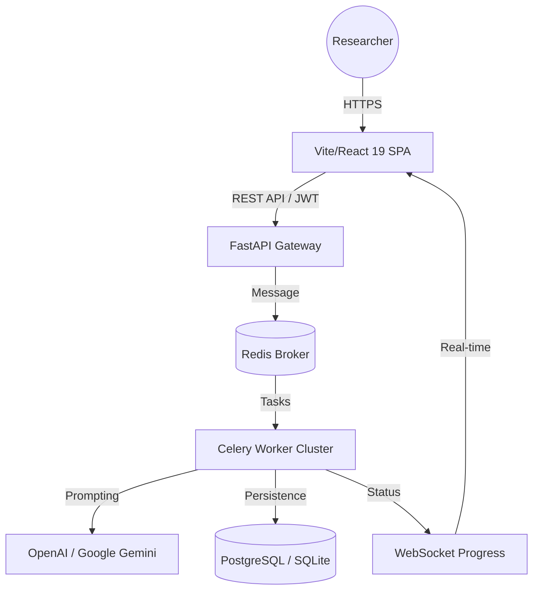

# ✨ AI Survey Generator: Enterprise Intelligence Suite 🤖

[](https://opensource.org/licenses/MIT)
[](https://fastapi.tiangolo.com/)
[](https://reactjs.org/)
[](https://www.typescriptlang.org/)
[](https://tailwindcss.com/)

**Transform raw research objectives into comprehensive, production-ready survey instruments in seconds.**

AI Survey Generator is an industrial-grade platform designed for market researchers, product managers, and data scientists. It leverages state-of-the-art LLMs (GPT-4o, Gemini 2.0) to automate the entire survey lifecycle—from conceptualization to final export.


---

## 🚀 Key Value Propositions

| Feature | Industrial Benefit |
| :--- | :--- |
| **Multi-Model AI Engine** | Choose between OpenAI GPT-4o or Google Gemini 2.0 based on cost and capability needs. |
| **Asynchronous Architecture** | Distributed task processing via Celery & Redis ensures the UI remains responsive during generation. |
| **Enterprise Security** | JWT-based authentication, password hashing (bcrypt), and granular rate limiting. |
| **Export Readiness** | Direct-to-DOCX export with professional formatting, ready for immediate field distribution. |
| **Real-time Observability** | WebSocket-driven progress tracking and structured JSON logging for monitoring. |

---

## 🏗️ System Architecture

The suite is built on a modern, decoupled architecture designed for scalability and reliability.



---

## 🛠️ Technology Stack

### **Core Infrastructure**
*   **Backend**: [FastAPI](https://fastapi.tiangolo.com/) (Python 3.9+)
*   **Database**: [SQLAlchemy 2.0](https://www.sqlalchemy.org/) (PostgreSQL for Prod, SQLite for Dev)
*   **Task Queue**: [Celery](https://docs.celeryproject.io/) with [Redis](https://redis.io/)
*   **AI Integration**: OpenAI (GPT-4o/Mini), Google Generative AI (Gemini 2.0 Flash)

### **Frontend Excellence**
*   **Framework**: [React 19](https://react.dev/) + [Vite](https://vitejs.dev/)
*   **State Management**: [Zustand](https://zustand-demo.pmnd.rs/)
*   **Styling**: [Tailwind CSS 3.4](https://tailwindcss.com/) + [Framer Motion](https://www.framer.com/motion/)
*   **HTTP Client**: [Axios](https://axios-http.com/) with interceptors for JWT management

---

## 🚦 Getting Started (Quick Setup)

### 1. Prerequisites
Ensure you have the following installed:
*   Python 3.9+
*   Node.js 18+
*   Redis Server (Running on default port 6379)

### 2. Automated Setup
We provide a comprehensive setup script for all systems:
*   **Windows**: Run `quick-start.bat`
*   **Unix/macOS**: Run `./quick-start.sh`

### 3. Environment Configuration
Create a `.env` file in the `backend/` directory:
```env
DATABASE_URL=sqlite:///./survey_generator.db
REDIS_URL=redis://localhost:6379/0
SECRET_KEY=your_secure_random_string
OPENAI_API_KEY=sk-...
GOOGLE_API_KEY=...
```

### 4. Running the Ecosystem
Open three terminal instances:

*   **API Service**: `cd backend && uvicorn app.main:app --reload`
*   **Worker Cluster**: `cd backend && celery -A app.core.celery worker --loglevel=info`
*   **Frontend**: `cd frontend-vite && npm run dev`

---

## 📖 API Documentation

Our API is fully documented with OpenAPI 3.0 standards. Once the backend is running, explore the interactive docs at:
*   **Swagger UI**: [http://localhost:8000/docs](http://localhost:8000/docs)
*   **ReDoc**: [http://localhost:8000/redoc](http://localhost:8000/redoc)

---

## 🔐 Security & Reliability

*   **Authentication**: Secure JWT Bearer tokens with 24-hour TTL.
*   **Rate Limiting**: Intelligent endpoint protection via `slowapi` to prevent abuse.
*   **Data Integrity**: Pydantic v2 for strict runtime data validation and serialization.
*   **Logging**: High-performance structured logging with `structlog`.
*   **Windows Native Support**: Optimized Celery pool configuration for Windows environments (see `WINDOWS_CELERY_SETUP.md`).

---

## 🤝 Contributions

Industrial systems thrive on collaboration. If you find a bug or have a feature proposal, please open an issue or submit a PR following our [Code Guidelines](VERIFICATION_CHECKLIST.ts).

---

## 📄 License

Distributed under the MIT License (see root).

---
*Built with ❤️ for the research community.*